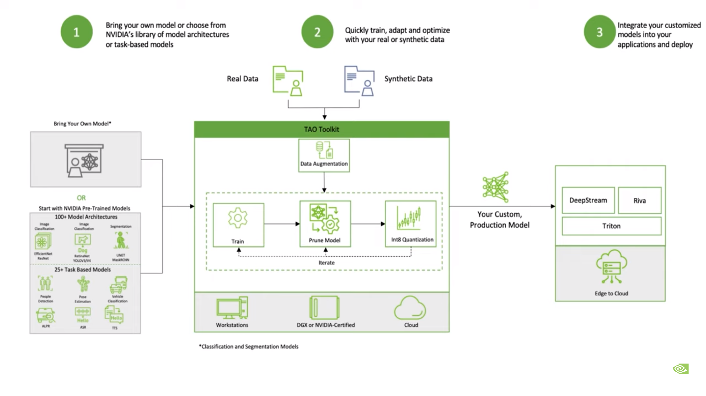

# TAO and Deepstream Installation Guide

## 1. [Installing TAO Toolkit on Your PC](TAO_Installation_On_PC/)
To install TAO toolkit on your PC, you can access the provided [link]() or the above repository. The repository contains a comprehensive guide on how to install TAO, which is a toolkit for training custom deep learning models. The installation guide provides step-by-step instructions for installing the required dependencies and downloading and installing TAO on your PC. By following this guide, you should be able to successfully install and use TAO on your PC.

## 2. [Installing Deepstream on Your PC](Deepstream_Installation_On_PC/).
To install Deepstream on your PC, you can access the provided [link](Deepstream_Installation_On_PC) or repository. The repository contains a detailed installation guide with step-by-step instructions on how to install the necessary dependencies and download and install Deepstream on your PC. Deepstream is a streaming analytics toolkit that can be used for processing large volumes of video data in real-time. By following this guide, you should be able to successfully install and use Deepstream on your PC, allowing you to process video data in real-time and perform advanced analytics.