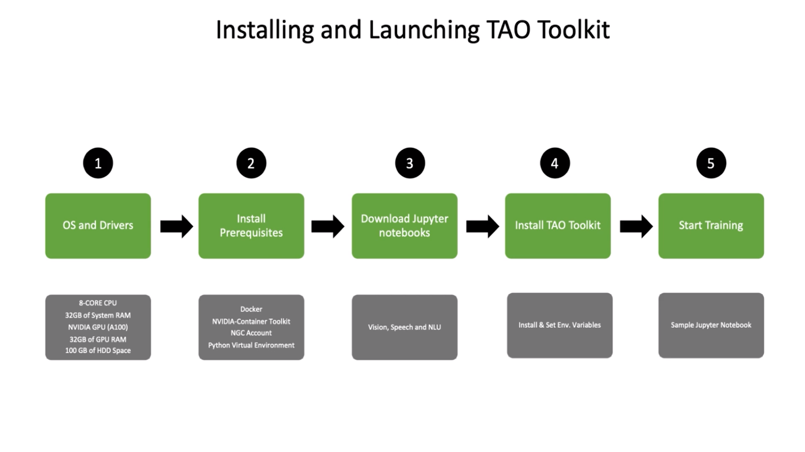
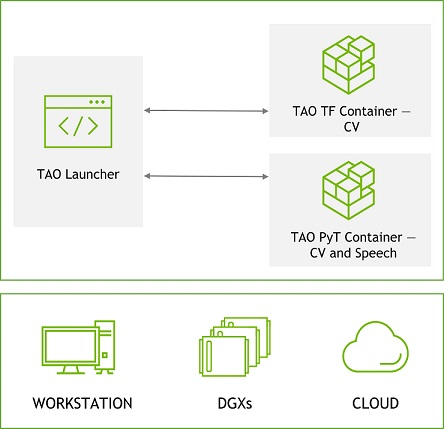

# TAO Toolkit Quick Start
The NVIDIA TAO Toolkit is a software tool that helps you train machine learning models without needing to be an expert in AI or having a lot of data. It makes the process easier and faster by using pre-existing models and allowing you to use your own data to improve them. This can help you make better predictions and decisions based on your specific needs.



# Requirements
## Minimum Hardware requirements
For optimal training performance using TAO Toolkit and its supported models, it is recommended to use the following system configuration:

* 32 GB system RAM
* 32 GB of GPU RAM
* 8 core CPU
* 1 NVIDIA GPU
* 100 GB of SSD space

TAO Toolkit is supported on discrete GPUs, such as H100, A100, A40, A30, A2, A16, A100x, A30x, V100, T4, Titan-RTX and Quadro-RTX.

> Note: TAO Toolkit is not supported on GPU's before the Pascal generation

## Software requirements
| Software | Version | Comment |
| --- | --- | --- |
| Ubuntu LTS | 20.04 | |
| python | >=3.6.9<3.7 | Not needed if you are using TAO API (See #3 below) |
| docker-ce | >19.03.5 | Not needed if you are using TAO API (See #3 below) |
| docker-API | 1.40 | Not needed if you are using TAO API (See #3 below) |
| nvidia-container-toolkit | >1.3.0-1 | Not needed if you are using TAO API (See #3 below) |
| nvidia-container-runtime | 3.4.0-1 | Not needed if you are using TAO API (See #3 below) |
| nvidia-docker2 | 2.5.0-1 | Not needed if you are using TAO API (See #3 below) |
| nvidia-driver | >520 | Not needed if you are using TAO API (See #3 below) |
| python-pip | >21.06 | Not needed if you are using TAO API (See #3 below) |

# Running TAO Toolkit
TAO toolkit is available as a docker container or a collection of python wheels. There are 4 ways to run TAO Toolkit depending on your preference and setup, through
1. the launcher CLI
2. the containers directly
3. the tao toolkit apis
4. python wheels

> In this particular case, we will be following the first option which is using the Launcher CLI to run TAO Toolkit. However, if you prefer to use TAO Toolkit in any of the other ways mentioned, you can refer to the official documentation for more information on how to do so.

## 1. Launcher CLI

The TAO Toolkit launcher is a simple command-line interface that is based on Python. It acts as a front-end for the TAO Toolkit containers, which are built on top of PyTorch and TensorFlow. The launcher makes it easier to use TAO Toolkit by abstracting away the details of which network is implemented in which container. When you select a particular model to use, the corresponding container is automatically launched by the CLI.



> To get started with the launcher, follow the instructions below to install the required pre-requisite software. 

## Installing the Pre-requisites.
>The TAO Toolkit launcher is strictly a python3 only package, capable of running on python versions >= 3.6.9.

#### 1. Docker Installation. 
The first step involves installing Docker, which is a platform for creating and running software in containers. To install Docker, you can follow the instructions provided in this [Link](https://docs.docker.com/engine/install/ubuntu/). This will allow you to download Docker-CE, which is the community edition of Docker, and install it on your computer. Once Docker is installed, you will be able to use it to run TAO Toolkit in a container


Once you have installed `docker-ce`, follow the [post-installation](https://docs.docker.com/engine/install/linux-postinstall/) steps to ensure that the docker can be run without `sudo`.

#### 2. Install nvidia-container-toolkit
To install the nvidia-container-toolkit, you can follow the Official [installation guide](https://docs.nvidia.com/datacenter/cloud-native/container-toolkit/install-guide.html) or you can follow the following steps provided. This toolkit is a set of tools and extensions that enable Docker containers to access the GPU on the host machine. By installing the nvidia-container-toolkit, you will be able to run TAO Toolkit in a Docker container with access to the GPU, which can greatly improve the performance of machine learning tasks.


1. Setting up NVIDIA Container Toolkit Setup the package repository and the GPG key:

    ```
    distribution=$(. /etc/os-release;echo $ID$VERSION_ID) \
          && curl -fsSL https://nvidia.github.io/libnvidia-container/gpgkey | sudo gpg --dearmor -o /usr/share/keyrings/nvidia-container-toolkit-keyring.gpg \
          && curl -s -L https://nvidia.github.io/libnvidia-container/$distribution/libnvidia-container.list | \
                sed 's#deb https://#deb [signed-by=/usr/share/keyrings/nvidia-container-toolkit-keyring.gpg] https://#g' | \
                sudo tee /etc/apt/sources.list.d/nvidia-container-toolkit.list
    ```
2. Install the nvidia-docker2 package (and dependencies) after updating the package listing:
    ```
    sudo apt-get update
    ```
    ```
    sudo apt-get install -y nvidia-docker2
    ```
    Configure the Docker daemon to recognize the NVIDIA Container Runtime:
    ```
    sudo nvidia-ctk runtime configure --runtime=docker
    ```
    Restart the Docker daemon to complete the installation after setting the default runtime:
    ```
    sudo systemctl restart docker
    ```
    At this point, a working setup can be tested by running a base CUDA container:
    ```
    sudo docker run --rm --runtime=nvidia --gpus all nvidia/cuda:11.6.2-base-ubuntu20.04 nvidia-smi
    ```
    This should result in a console output shown below:
    ```
        +-----------------------------------------------------------------------------+
        | NVIDIA-SMI 525.105.17   Driver Version: 525.105.17   CUDA Version: 12.0     |
        |-------------------------------+----------------------+----------------------+
        | GPU  Name        Persistence-M| Bus-Id        Disp.A | Volatile Uncorr. ECC |
        | Fan  Temp  Perf  Pwr:Usage/Cap|         Memory-Usage | GPU-Util  Compute M. |
        |                               |                      |               MIG M. |
        |===============================+======================+======================|
        |   0  NVIDIA GeForce ...  On   | 00000000:05:00.0  On |                  N/A |
        |  0%   49C    P8    18W / 170W |    447MiB / 12288MiB |      1%      Default |
        |                               |                      |                  N/A |
        +-------------------------------+----------------------+----------------------+
                                                                                           
        +-----------------------------------------------------------------------------+
        | Processes:                                                                  |
        |  GPU   GI   CI        PID   Type   Process name                  GPU Memory |
        |        ID   ID                                                   Usage      |
        |=============================================================================|
        +-----------------------------------------------------------------------------+
    ```

#### 3. Get an [NGC](https://catalog.ngc.nvidia.com/?filters=&orderBy=weightPopularASC&query=) account and API key:
a.  Go to NGC and click the `TAO Toolkit` container in the `Catalog` tab. This message is displayed: “Sign in to access the PULL feature of this repository”.
b. Enter your Email address and click `Next`, or click `Create an Account`.
c. Choose your organization when prompted for `Organization/Team`.
d.  Click `Sign In`.

#### 4. Log in to the NGC docker registry (nvcr.io) using the following command.

```
docker login nvcr.io
```
and enter the following credentials:

```
a. Username: "$oauthtoken"
b. Password: "YOUR_NGC_API_KEY"
```
where `YOUR_NGC_API_KEY` corresponds to the key you generated from step 3.


#### 5. Setup python environment
NVIDIA recommends setting up a python environment using `miniconda`. The following instructions show how to setup a python `conda` environment.

1. Follow the instructions in this [link](https://docs.conda.io/en/latest/miniconda.html) to set up a conda environment using a miniconda.

2. Once you have installed `miniconda`, create a new environment by setting the Python version to 3.6.
    ```
    conda create -n launcher python=3.
    ```
3. Activate the conda environment that you have just created.
    ```
    conda activate launcher
    ```
4. Once you have activated your conda environment, the command prompt should show the name of your conda environment.
    ```
    (launcher) py-3.6.9 desktop:
    ```
5. When you are done with you session, you may deactivate your conda environment using the deactivate command:
    ```
    conda deactivate
    ```
6. You may re-instantiate this created conda environment using the following command
    ```
    conda activate launcher
    ```
# 2. Installing TAO Launcher

1. Download the TAO package
To download the `TAO` package, you can execute a command that will retrieve a collection of files containing startup scripts, Jupyter notebooks, and configuration files necessary for running `TAO` software. This command will allow you to obtain all the required files in a convenient and organized package for your usage.

<<<<<<< HEAD
    **DIRECTLY FROM CONTAINER**

=======
    > The TAO launcher can be installed in two ways:

    a. Directly from the container

    b. Using the CLI launcher via the quick start script.

    **A. Directly From Container**
    
>>>>>>> 229cc1b5ea8c5bf48d7c26de6cf3e074415fcde2
    Users have option to also run TAO directly using the docker container. To use container directly, user needs to know which container to pull. There are multiple containers under TAO, and depending on the model that you want to train you will need to pull the appropriate container. This is not required when using the Launcher CLI.

    ```
    wget --content-disposition https://api.ngc.nvidia.com/v2/resources/nvidia/tao/tao-getting-started/versions/4.0.1/zip -O getting_started_v4.0.1.zip
    unzip -u getting_started_v4.0.1.zip  -d ./getting_started_v4.0.1 && rm -rf getting_started_v4.0.1.zip && cd ./getting_started_v4.0.1
    ```
    More information about running directly from docker is provided in [TAO documentation - Container](https://docs.nvidia.com/tao/tao-toolkit/text/working_with_the_containers.html)
    

    **B. Via Quick Start Script**

    Use the setup/quickstart_launcher.sh to validate your setup and install TAO launcher. Jupyter notebooks to train using the Launcher is provided under notebooks/launcher_starter_kit.

    ```
    bash setup/quickstart_launcher.sh --install
    ```
    **File Hierarchy**
    ```
    setup
        |--> quickstart_launcher.sh
        |--> quickstart_api_bare_metal
        |--> quickstart_api_aws_eks
    notebooks
        |--> tao_api_starter_kit
            |--> api
                |--> automl
                |--> end2end
                |--> dataset_prepare
            |--> client
                |--> automl
                |--> end2end
                |--> dataset_prepare
        |--> tao_launcher_starter_kit
            |--> yolov4_tiny
            |--> yolov4
            |--> yolov3
            |-->  ...
    ```

2. You can also use this script to update the launcher to the latest version of TAO Toolkit by running the following command.

    ```
    bash setup/quickstart_launcher.sh --upgrade
    ```
3. Invoke the entrypoints using the `tao` command.
    ```
    tao --help
    ```
    The sample output of the above command is:
    ```
    usage: tao [-h]
             {list,stop,info,augment,bpnet,classification,detectnet_v2,dssd,emotionnet,faster_rcnn,fpenet,gazenet,gesturenet,
             heartratenet,intent_slot_classification,lprnet,mask_rcnn,punctuation_and_capitalization,question_answering,
             retinanet,speech_to_text,ssd,text_classification,converter,token_classification,unet,yolo_v3,yolo_v4,yolo_v4_tiny}
             ...
    
    Launcher for TAO

    optional arguments:
    -h, --help            show this help message and exit
    
    tasks:
          {list,stop,info,augment,bpnet,classification,detectnet_v2,dssd,emotionnet,faster_rcnn,fpenet,gazenet,gesturenet,heartratenet
          ,intent_slot_classification,lprnet,mask_rcnn,punctuation_and_capitalization,question_answering,retinanet,speech_to_text,
          ssd,text_classification,converter,token_classification,unet,yolo_v3,yolo_v4,yolo_v4_tiny}
    ```
    > Note
    
    > When installing the TAO Toolkit Launcher to your host machine’s native python3 as opposed to the recommended route of using virtual environment, you may get an error saying that tao binary wasn’t found. This is because the path to your tao binary installed by pip wasn’t added to the PATH environment variable in your local machine. In this case, please run the following command:
    ```
    export PATH=$PATH:~/.local/bin
    ```
